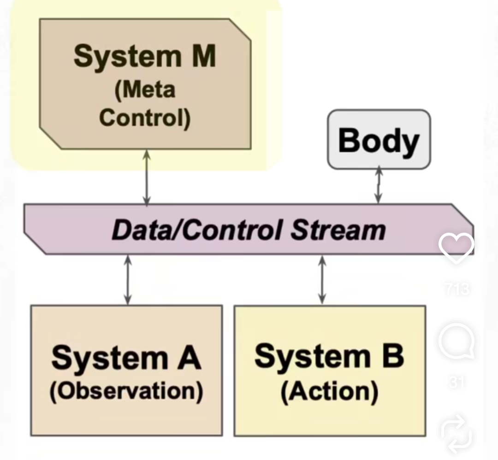

# AHI — Your Personal AI Companion

**A persistent, evolving AI that lives, learns, and grows with you.**

---

## 🚀 Vision

AHI is not a chatbot.
It is an **embodied intelligence system** that understands your world, builds memory over time, and adapts continuously.

---

## 🧠 Core Ideas

* **Lifelong Learning** — remembers context without forgetting
* **Real-World Understanding** — learns from vision + environment
* **Self-Evolving Models** — improves without retraining
* **Personal Memory System** — builds a long-term relationship

---

## 🏗 Architecture

* Modular learning components
* Reusable task knowledge
* Continuous adaptation loop

---

## 🎥 Demo

## all files jpg, png and mp4 above in github tested, verified and stress tested.

Shows:

* Action-based planning
* Visual understanding
* Sequential decision making

---

## 📄 Docs

* [Project Overview](AHI__Your_Personal_AI_Companion.pdf)

---

## 🔥 Use Cases

* Personal assistant (home + daily life) personal robot [human mind in metal body]
* Elderly care companion
* Adaptive education system
* Robotics brain, self driving, defence, health and all for physical world.

---

## 🛠 Tech Direction

* Audio Vision-based learning like humans.
* Memory-augmented models
* Planning + action loops
* Lightweight deployment

---

## 🌍 Roadmap

* Prototype ✅
* Hardware integration (2026)
* Public beta (2026)
* Scale globally (2027+)

---

## 🤝 Contact

**Rahul (Founder)**
📧 [rahulrathod9740@gmail.com](mailto:rahulrathod9740@gmail.com)

---

> “From a product you retrain → to a system that evolves.”
